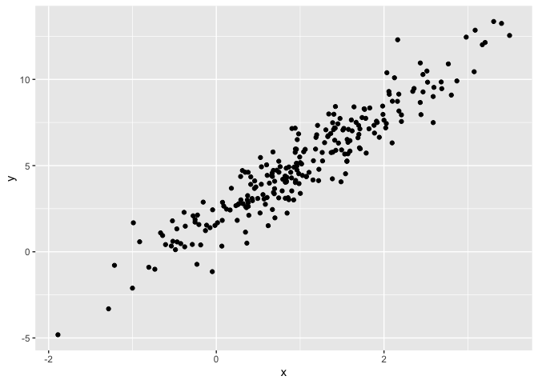
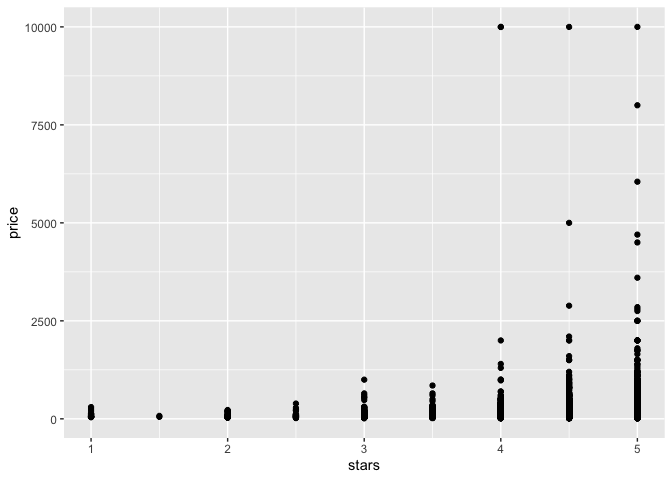

Bootstrapping
================
Ruilian Zhang
11/23/2021

``` r
library(tidyverse)
```

    ## ── Attaching packages ─────────────────────────────────────── tidyverse 1.3.1 ──

    ## ✓ ggplot2 3.3.5     ✓ purrr   0.3.4
    ## ✓ tibble  3.1.4     ✓ dplyr   1.0.7
    ## ✓ tidyr   1.1.3     ✓ stringr 1.4.0
    ## ✓ readr   2.0.1     ✓ forcats 0.5.1

    ## ── Conflicts ────────────────────────────────────────── tidyverse_conflicts() ──
    ## x dplyr::filter() masks stats::filter()
    ## x dplyr::lag()    masks stats::lag()

``` r
library(p8105.datasets)
library(modelr)

set.seed(1)
```

``` r
n_samp = 250

sim_df_const = 
  tibble(
    x = rnorm(n_samp, 1, 1),
    error = rnorm(n_samp, 0, 1),
    y = 2 + 3 * x + error
  )

sim_df_nonconst = sim_df_const %>% 
  mutate(
  error = error * .75 * x,
  y = 2 + 3 * x + error
)
```

``` r
sim_df_const %>% 
  ggplot(aes(x = x, y = y)) +
  geom_point()
```

<!-- -->

``` r
sim_df_nonconst %>% 
  lm(y ~ x, data = .) %>% 
  broom::tidy()
```

    ## # A tibble: 2 × 5
    ##   term        estimate std.error statistic   p.value
    ##   <chr>          <dbl>     <dbl>     <dbl>     <dbl>
    ## 1 (Intercept)     1.93    0.105       18.5 1.88e- 48
    ## 2 x               3.11    0.0747      41.7 5.76e-114

## Try biitstrap for inference

``` r
bootstrap_sample = 
  sim_df_nonconst %>% 
  sample_frac(size = 1, replace = TRUE) %>% 
  arrange(x)

lm(y ~ x, data = bootstrap_sample)
```

    ## 
    ## Call:
    ## lm(formula = y ~ x, data = bootstrap_sample)
    ## 
    ## Coefficients:
    ## (Intercept)            x  
    ##       1.897        3.196

Lets’ write a function..

``` r
boot_sample = function(df) {
  
  sample_frac(df, size = 1, replace = TRUE)
  
}
```

``` r
boot_trap_df = 
  tibble(
    strap_number = 1:1000,
    strap_sample = rerun(1000, boot_sample(sim_df_nonconst))
  )
```

``` r
boot_trap_df %>% 
  mutate(
    models = map(.x = strap_sample, ~ lm(y ~ x, data = .x)),
    results = map(models, broom::tidy)
  )
```

    ## # A tibble: 1,000 × 4
    ##    strap_number strap_sample       models results         
    ##           <int> <list>             <list> <list>          
    ##  1            1 <tibble [250 × 3]> <lm>   <tibble [2 × 5]>
    ##  2            2 <tibble [250 × 3]> <lm>   <tibble [2 × 5]>
    ##  3            3 <tibble [250 × 3]> <lm>   <tibble [2 × 5]>
    ##  4            4 <tibble [250 × 3]> <lm>   <tibble [2 × 5]>
    ##  5            5 <tibble [250 × 3]> <lm>   <tibble [2 × 5]>
    ##  6            6 <tibble [250 × 3]> <lm>   <tibble [2 × 5]>
    ##  7            7 <tibble [250 × 3]> <lm>   <tibble [2 × 5]>
    ##  8            8 <tibble [250 × 3]> <lm>   <tibble [2 × 5]>
    ##  9            9 <tibble [250 × 3]> <lm>   <tibble [2 × 5]>
    ## 10           10 <tibble [250 × 3]> <lm>   <tibble [2 × 5]>
    ## # … with 990 more rows

``` r
bootstrap_results = 
  boot_trap_df %>% 
  mutate(
    models = map(.x = strap_sample, ~ lm(y ~ x, data = .x)),
    results = map(models, broom::tidy)
  ) %>% 
  select(strap_number, results) %>% 
  unnest(results)

bootstrap_results %>% 
  group_by(term) %>% 
  summarize(
    se = sd(estimate)
  )
```

    ## # A tibble: 2 × 2
    ##   term            se
    ##   <chr>        <dbl>
    ## 1 (Intercept) 0.0747
    ## 2 x           0.101

## Use modelr

``` r
sim_df_nonconst %>% 
  bootstrap(n = 1000, id = "strap_number") %>% 
  mutate(
    models = map(.x = strap, ~ lm(y~ x, data = .x)),
    results = map(models, broom::tidy)
  )
```

    ## # A tibble: 1,000 × 4
    ##    strap                strap_number models results         
    ##    <list>               <chr>        <list> <list>          
    ##  1 <resample [250 x 3]> 0001         <lm>   <tibble [2 × 5]>
    ##  2 <resample [250 x 3]> 0002         <lm>   <tibble [2 × 5]>
    ##  3 <resample [250 x 3]> 0003         <lm>   <tibble [2 × 5]>
    ##  4 <resample [250 x 3]> 0004         <lm>   <tibble [2 × 5]>
    ##  5 <resample [250 x 3]> 0005         <lm>   <tibble [2 × 5]>
    ##  6 <resample [250 x 3]> 0006         <lm>   <tibble [2 × 5]>
    ##  7 <resample [250 x 3]> 0007         <lm>   <tibble [2 × 5]>
    ##  8 <resample [250 x 3]> 0008         <lm>   <tibble [2 × 5]>
    ##  9 <resample [250 x 3]> 0009         <lm>   <tibble [2 × 5]>
    ## 10 <resample [250 x 3]> 0010         <lm>   <tibble [2 × 5]>
    ## # … with 990 more rows

## Airbnb

``` r
data("nyc_airbnb")

nyc_air_bnb = 
  nyc_airbnb %>% 
  mutate(stars = review_scores_location  / 2) %>%
  rename(
    borough = neighbourhood_group
  ) %>% 
  filter(borough != "Staten Island") %>% 
  select(price, stars, borough, room_type)
```

``` r
nyc_air_bnb %>% 
  ggplot(aes(x = stars, y = price)) +
  geom_point()
```

    ## Warning: Removed 9962 rows containing missing values (geom_point).

<!-- -->

``` r
airbnb_results = 
  nyc_air_bnb %>% 
    filter(borough == "Manhattan") %>% 
    bootstrap(n = 1000, id = "strap_number") %>% 
    mutate(
      models = map(strap, ~ lm(price ~ stars, data = .x)),
      results = map(models, broom::tidy)
    ) %>% 
    select(strap_number, results) %>% 
    unnest(results)

ggp_star_density = 
  airbnb_results %>% 
  filter(term == "stars") %>% 
  ggplot(aes(estimate)) +
  geom_density()

ggp_scatter = 
  nyc_air_bnb %>% 
  filter(borough == "Manhattan") %>% 
  ggplot(aes(x = stars, y = price)) +
  geom_point()
```
